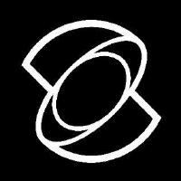
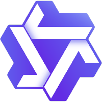
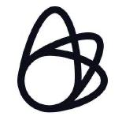
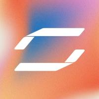

<div align="center">
  
</div>

<div align="center">
  <h1>WBench: A Comprehensive Multi-turn Benchmark for<br>Interactive Video World Model Evaluation</h1>
</div>

<div align="center">

**Kaining Ying**<sup>&ast;</sup>, **Hengrui Hu**<sup>&ast;</sup>, **Siyu Ren**<sup></sup>, Jiamu Li<sup></sup>, Fengjiao Chen<sup></sup>,<br>Ziwen Wang<sup></sup>, Xuezhi Cao<sup></sup>, Xunliang Cai<sup></sup>, Henghui Ding<sup></sup> <sup>[✉️](mailto:hhding@fudan.edu.cn)</sup>
<br>
<sup></sup> Fudan University &nbsp;&nbsp; <sup></sup> Meituan LongCat Team

</div>

<div align="center">

[](https://meituan-longcat.github.io/WBench/)
[](https://arxiv.org/abs/2605.25874)
[](https://huggingface.co/papers/2605.25874)
[](https://meituan-longcat.github.io/WBench/#leaderboard)
[](https://huggingface.co/datasets/meituan-longcat/WBench)
[](https://huggingface.co/meituan-longcat/WBench-weights)
[](https://huggingface.co/datasets/meituan-longcat/WBench-examples)
[](https://modelscope.cn/datasets/meituan-longcat/WBench)
[](https://mp.weixin.qq.com/s/br3RlOBGtReolLZc5YW2HA)
[](https://weixin.qq.com/sph/Aue3nWCWCx)
[](https://x.com/Meituan_LongCat/status/2059658634829996047)
[](assets/wx_qr.png)

</div>

<div align="center">
  <i>Is Your World Model an All-Round Player?</i>
</div>

---

<div align="center">
  
</div>

<p align="center" style="color: grey;">
<b>TL;DR</b> — WBench evaluates 22 video world models across 5 dimensions and 22 metrics.
</p>

<div align="center">
  
</div>

## 📢 News

- **[2026/06/18]** 🆕 Added [DreamX-World (5B AR)](https://github.com/AMAP-ML/DreamX-World) to the leaderboard (now 24 models).
- **[2026/06/17]** 🆕 Added [LingBot-World (fast)](https://github.com/robbyant/lingbot-world) to the leaderboard (now 23 models).
- **[2026/06/16]** 🔌 Open-sourced the [HY-World 1.5 integration example](examples/hy_worldplay).
- **[2026/06/16]** 🆕 Added 2 camera-controlled world models — [Lyra 2.0](https://research.nvidia.com/labs/sil/projects/lyra2/) & [SANA-WM](https://nvlabs.github.io/Sana/WM/) (4-step AR).
- **[2026/06/10]** 🧭 Added [HY-World 1.5 pose exports](https://huggingface.co/datasets/meituan-longcat/WBench-examples/tree/main/hyworld1.5/poses) to [WBench-examples](https://huggingface.co/datasets/meituan-longcat/WBench-examples).
- **[2026/06/01]** WBench is now an official benchmark on [Hugging Face](https://huggingface.co/datasets/meituan-longcat/WBench) 🤗 (navi & full tasks)!
- **[2026/06/01]** 📦 Released [WBench-examples](https://huggingface.co/datasets/meituan-longcat/WBench-examples): ready-to-eval videos from HY-World 1.5 & Kling 3.0.
- **[2026/06/01]** 🎮 Added [camera- & action-conditioned examples](#-implement-your-model) + web automation (Genie3, Happy Oyster).
- **[2026/06/01]** Added [Claude Code skills](#-claude-code-skills) 🤖 for generation, evaluation & submission.
- **[2026/05/29]** Paper ranked **#2** 🏅 on [Hugging Face Daily Papers](https://huggingface.co/papers/2605.25874)!
- **[2026/05/28]** Paper now available on [arXiv](https://arxiv.org/abs/2605.25874) 📄!
- **[2026/05/28]** [Homepage](https://meituan-longcat.github.io/WBench/) with interactive [leaderboard](https://meituan-longcat.github.io/WBench/#leaderboard) & [dataset gallery](https://meituan-longcat.github.io/WBench/#gallery) is live! 🌐
- **[2026/05/28]** 🚀 Released the full [WBench dataset](https://huggingface.co/datasets/meituan-longcat/WBench), [evaluation code](https://github.com/meituan-longcat/WBench) & [model weights](https://huggingface.co/meituan-longcat/WBench-weights).

## ✨ Contributions

- A **comprehensive evaluation framework** with 289 cases, 1,058 interaction turns, covering 4 interaction types (navigation, subject action, event editing, perspective switching) across diverse scenes and perspectives.
- A **unified navigation protocol** that bridges text, 6-DoF camera pose, and discrete-action interfaces, enabling fair comparison across model families.
- **22 automatic metrics** spanning 5 complementary dimensions, validated against human judgments, ensuring reliable automatic evaluation at scale.
- **Systematic diagnosis of 24 models** revealing that current world models have not yet unified high-fidelity rendering with reliable controllability, consistency, and physics compliance.

## 🏆 Leaderboard

**24 Models — Navigation Split (5 Dimensions, sorted by average)**

| # | Model | **Average** | Quality | Setting | Interaction | Consistency | Physical |
|:---:|:---|:---:|:---:|:---:|:---:|:---:|:---:|
| 1 |  Kling 3.0 | **79.2 🥇** | 83.0 🥈 | 91.0 🥈 | 70.3 &nbsp;&nbsp; | 82.5 &nbsp;&nbsp; | 69.3 🥉 |
| 2 |  LingBot-World (base-camera) | **78.8 🥈** | 81.5 &nbsp;&nbsp; | 72.6 &nbsp;&nbsp; | 79.8 &nbsp;&nbsp; | 88.9 🥇 | 71.2 🥈 |
| 3 |  Wan 2.7 | **78.5 🥉** | 82.6 🥉 | 91.4 🥇 | 66.0 &nbsp;&nbsp; | 80.5 &nbsp;&nbsp; | 71.8 🥇 |
| 4 |  HY-World 1.5 (ar-distill) | **78.4** &nbsp;&nbsp; &nbsp; | 80.2 &nbsp;&nbsp; | 72.2 &nbsp;&nbsp; | 87.5 🥇 | 86.0 &nbsp;&nbsp; | 66.3 &nbsp;&nbsp; |
| 5 |  HY-Video 1.5 | **78.2** &nbsp;&nbsp; | 79.7 &nbsp;&nbsp; | 85.6 🥉 | 71.8 &nbsp;&nbsp; | 86.7 🥉 | 67.4 &nbsp;&nbsp; |
| 6 |  LingBot-World (fast) | **77.4** &nbsp;&nbsp; | 79.3 &nbsp;&nbsp; | 77.9 &nbsp;&nbsp; | 79.4 &nbsp;&nbsp; | 84.9 &nbsp;&nbsp; | 65.7 &nbsp;&nbsp; |
| 7 |  Happy Oyster | **77.1** &nbsp;&nbsp; | 79.3 &nbsp;&nbsp; | 74.2 &nbsp;&nbsp; | 85.1 🥉 | 83.3 &nbsp;&nbsp; | 63.5 &nbsp;&nbsp; |
| 8 |  Seedance 1.5 | **76.5** &nbsp;&nbsp; | 83.2 🥇 | 82.9 &nbsp;&nbsp; | 68.0 &nbsp;&nbsp; | 80.2 &nbsp;&nbsp; | 68.4 &nbsp;&nbsp; |
| 9 |  Lyra 2.0 (4-step AR) | **76.4** &nbsp;&nbsp; | 78.8 &nbsp;&nbsp; | 73.2 &nbsp;&nbsp; | 85.4 🥈 | 77.8 &nbsp;&nbsp; | 66.7 &nbsp;&nbsp; |
| 10 |  SANA-WM (4-step AR) | **76.0** &nbsp;&nbsp; | 80.9 &nbsp;&nbsp; | 76.1 &nbsp;&nbsp; | 82.1 &nbsp;&nbsp; | 79.3 &nbsp;&nbsp; | 61.9 &nbsp;&nbsp; |
| 11 |  Cosmos 2.5 | **75.2** &nbsp;&nbsp; | 75.6 &nbsp;&nbsp; | 83.3 &nbsp;&nbsp; | 64.1 &nbsp;&nbsp; | 85.6 &nbsp;&nbsp; | 67.4 &nbsp;&nbsp; |
| 12 |  DreamX-World (5B AR) | **75.0** &nbsp;&nbsp; | 77.5 &nbsp;&nbsp; | 80.8 &nbsp;&nbsp; | 78.4 &nbsp;&nbsp; | 74.8 &nbsp;&nbsp; | 63.3 &nbsp;&nbsp; |
| 13 |  LTX 2.3 | **74.4** &nbsp;&nbsp; | 78.7 &nbsp;&nbsp; | 85.2 &nbsp;&nbsp; | 67.6 &nbsp;&nbsp; | 75.6 &nbsp;&nbsp; | 64.9 &nbsp;&nbsp; |
| 14 |  InSpatio-World | **74.3** &nbsp;&nbsp; | 74.9 &nbsp;&nbsp; | 71.4 &nbsp;&nbsp; | 72.8 &nbsp;&nbsp; | 87.4 🥈 | 65.2 &nbsp;&nbsp; |
| 15 |  Fantasy-World | **74.2** &nbsp;&nbsp; | 75.5 &nbsp;&nbsp; | 71.3 &nbsp;&nbsp; | 72.1 &nbsp;&nbsp; | 85.3 &nbsp;&nbsp; | 66.8 &nbsp;&nbsp; |
| 16 |  Genie 3 | **74.1** &nbsp;&nbsp; | 77.4 &nbsp;&nbsp; | 72.5 &nbsp;&nbsp; | 73.3 &nbsp;&nbsp; | 81.4 &nbsp;&nbsp; | 65.7 &nbsp;&nbsp; |
| 17 |  LongCat-Video | **73.7** &nbsp;&nbsp; | 78.2 &nbsp;&nbsp; | 72.3 &nbsp;&nbsp; | 63.1 &nbsp;&nbsp; | 85.9 &nbsp;&nbsp; | 68.9 &nbsp;&nbsp; |
| 18 |  YUME 1.5 | **73.5** &nbsp;&nbsp; | 79.5 &nbsp;&nbsp; | 72.4 &nbsp;&nbsp; | 72.0 &nbsp;&nbsp; | 78.6 &nbsp;&nbsp; | 65.2 &nbsp;&nbsp; |
| 19 |  Infinite-World | **72.9** &nbsp;&nbsp; | 78.7 &nbsp;&nbsp; | 69.3 &nbsp;&nbsp; | 75.9 &nbsp;&nbsp; | 78.7 &nbsp;&nbsp; | 62.1 &nbsp;&nbsp; |
| 20 |  MatrixGame3 | **71.2** &nbsp;&nbsp; | 76.9 &nbsp;&nbsp; | 63.6 &nbsp;&nbsp; | 83.5 &nbsp;&nbsp; | 72.9 &nbsp;&nbsp; | 59.3 &nbsp;&nbsp; |
| 21 |  Kairos 3.0 | **70.7** &nbsp;&nbsp; | 76.4 &nbsp;&nbsp; | 70.3 &nbsp;&nbsp; | 65.1 &nbsp;&nbsp; | 81.4 &nbsp;&nbsp; | 60.4 &nbsp;&nbsp; |
| 22 |  HY-GameCraft | **68.5** &nbsp;&nbsp; | 74.9 &nbsp;&nbsp; | 66.6 &nbsp;&nbsp; | 67.8 &nbsp;&nbsp; | 70.6 &nbsp;&nbsp; | 62.4 &nbsp;&nbsp; |
| 23 |  MatrixGame2 | **68.5** &nbsp;&nbsp; | 75.7 &nbsp;&nbsp; | 67.1 &nbsp;&nbsp; | 80.6 &nbsp;&nbsp; | 62.0 &nbsp;&nbsp; | 57.2 &nbsp;&nbsp; |
| 24 |  Astra | **64.0** &nbsp;&nbsp; | 69.7 &nbsp;&nbsp; | 59.6 &nbsp;&nbsp; | 67.7 &nbsp;&nbsp; | 71.6 &nbsp;&nbsp; | 51.4 &nbsp;&nbsp; |


**9 Text-driven Models — Full Split (5 Dimensions, sorted by average)**

| # | Model | **Average** | Quality | Setting | Interaction | Consistency | Physical |
|:---:|:---|:---:|:---:|:---:|:---:|:---:|:---:|
| 1 |  Kling 3.0 | **79.5 🥇** | 81.8 🥉 | 91.0 🥈 | 73.1 🥇 | 82.6 &nbsp;&nbsp; | 69.2 🥈 |
| 2 |  Wan 2.7 | **78.2 🥈** | 82.2 🥈 | 91.4 🥇 | 72.1 🥈 | 73.8 &nbsp;&nbsp; | 71.6 🥇 |
| 3 |  Seedance 1.5 | **76.2 🥉** | 83.0 🥇 | 82.9 &nbsp;&nbsp; | 68.3 🥉 | 78.5 &nbsp;&nbsp; | 68.2 &nbsp;&nbsp; |
| 4 |  HY-Video 1.5 | **74.6** &nbsp;&nbsp; | 78.9 &nbsp;&nbsp; | 85.6 🥉 | 54.7 &nbsp;&nbsp; | 86.8 🥇 | 67.1 &nbsp;&nbsp; |
| 5 |  LTX 2.3 | **71.0** &nbsp;&nbsp; | 78.8 &nbsp;&nbsp; | 85.2 &nbsp;&nbsp; | 49.4 &nbsp;&nbsp; | 76.4 &nbsp;&nbsp; | 65.1 &nbsp;&nbsp; |
| 6 |  Cosmos 2.5 | **70.8** &nbsp;&nbsp; | 74.6 &nbsp;&nbsp; | 83.3 &nbsp;&nbsp; | 43.5 &nbsp;&nbsp; | 85.4 🥉 | 67.0 &nbsp;&nbsp; |
| 7 |  LongCat-Video | **70.2** &nbsp;&nbsp; | 79.7 &nbsp;&nbsp; | 72.3 &nbsp;&nbsp; | 45.1 &nbsp;&nbsp; | 85.5 🥈 | 68.4 🥉 |
| 8 |  YUME 1.5 | **69.0** &nbsp;&nbsp; | 79.7 &nbsp;&nbsp; | 72.4 &nbsp;&nbsp; | 48.4 &nbsp;&nbsp; | 79.3 &nbsp;&nbsp; | 65.4 &nbsp;&nbsp; |
| 9 |  Kairos 3.0 | **66.0** &nbsp;&nbsp; | 75.8 &nbsp;&nbsp; | 70.3 &nbsp;&nbsp; | 41.6 &nbsp;&nbsp; | 81.9 &nbsp;&nbsp; | 60.5 &nbsp;&nbsp; |

<details>
<summary><b>24 Models — Navigation Split (19 metrics)</b></summary>

| Model | Aesthetic Quality | Imaging Quality | Background Consistency | Temporal Flickering | Dynamic Degree | Motion Smoothness | HPSv3 Quality | Scene Adherence | Subject Adherence | Navigation Trajectory | Spatial Consistency | Gated Spatial Consistency | Perspective Consistency | Segment Continuity | Geometric Consistency | Photometric Consistency | Subject Consistency Cross-Model | Visual Plausibility | Causal Fidelity |
|:---|:---:|:---:|:---:|:---:|:---:|:---:|:---:|:---:|:---:|:---:|:---:|:---:|:---:|:---:|:---:|:---:|:---:|:---:|:---:|
|  HY-Video 1.5 | 63.4 &nbsp;&nbsp; | 67.4 &nbsp;&nbsp; | 92.1 &nbsp;&nbsp; | 94.2 &nbsp;&nbsp; | 73.9 &nbsp;&nbsp; | 98.7 &nbsp;&nbsp; | 68.0 &nbsp;&nbsp; | 77.5 &nbsp;&nbsp; | 93.6 &nbsp;&nbsp; | 71.8 &nbsp;&nbsp; | 79.2 &nbsp;&nbsp; | 75.1 &nbsp;&nbsp; | 86.6 &nbsp;&nbsp; | 99.4 &nbsp;&nbsp; | 94.6 &nbsp;&nbsp; | 80.3 &nbsp;&nbsp; | 91.6 &nbsp;&nbsp; | 59.7 &nbsp;&nbsp; | 75.0 &nbsp;&nbsp; |
|  Kling 3.0 | 63.0 &nbsp;&nbsp; | 68.1 &nbsp;&nbsp; | 92.3 &nbsp;&nbsp; | 93.2 &nbsp;&nbsp; | 97.5 &nbsp;&nbsp; | 97.6 &nbsp;&nbsp; | 69.1 &nbsp;&nbsp; | 89.0 &nbsp;&nbsp; | 92.9 &nbsp;&nbsp; | 70.3 &nbsp;&nbsp; | 75.2 &nbsp;&nbsp; | 75.1 &nbsp;&nbsp; | 76.8 &nbsp;&nbsp; | 93.0 &nbsp;&nbsp; | 88.9 &nbsp;&nbsp; | 79.9 &nbsp;&nbsp; | 88.5 &nbsp;&nbsp; | 60.7 &nbsp;&nbsp; | 78.0 &nbsp;&nbsp; |
|  Cosmos 2.5 | 61.8 &nbsp;&nbsp; | 66.9 &nbsp;&nbsp; | 92.3 &nbsp;&nbsp; | 94.8 &nbsp;&nbsp; | 49.0 &nbsp;&nbsp; | 98.2 &nbsp;&nbsp; | 66.5 &nbsp;&nbsp; | 72.4 &nbsp;&nbsp; | 94.2 &nbsp;&nbsp; | 64.1 &nbsp;&nbsp; | 78.1 &nbsp;&nbsp; | 74.3 &nbsp;&nbsp; | 84.3 &nbsp;&nbsp; | 94.3 &nbsp;&nbsp; | 94.6 &nbsp;&nbsp; | 81.6 &nbsp;&nbsp; | 92.3 &nbsp;&nbsp; | 60.1 &nbsp;&nbsp; | 74.7 &nbsp;&nbsp; |
|  LTX 2.3 | 57.9 &nbsp;&nbsp; | 61.0 &nbsp;&nbsp; | 88.3 &nbsp;&nbsp; | 93.2 &nbsp;&nbsp; | 98.1 &nbsp;&nbsp; | 96.4 &nbsp;&nbsp; | 56.1 &nbsp;&nbsp; | 81.3 &nbsp;&nbsp; | 89.2 &nbsp;&nbsp; | 67.6 &nbsp;&nbsp; | 70.2 &nbsp;&nbsp; | 70.2 &nbsp;&nbsp; | 69.8 &nbsp;&nbsp; | 75.8 &nbsp;&nbsp; | 76.9 &nbsp;&nbsp; | 79.2 &nbsp;&nbsp; | 87.2 &nbsp;&nbsp; | 55.7 &nbsp;&nbsp; | 74.0 &nbsp;&nbsp; |
|  Seedance 1.5 | 61.0 &nbsp;&nbsp; | 69.3 &nbsp;&nbsp; | 89.6 &nbsp;&nbsp; | 92.4 &nbsp;&nbsp; | 99.4 &nbsp;&nbsp; | 97.5 &nbsp;&nbsp; | 73.0 &nbsp;&nbsp; | 71.6 &nbsp;&nbsp; | 94.2 &nbsp;&nbsp; | 68.0 &nbsp;&nbsp; | 72.7 &nbsp;&nbsp; | 72.4 &nbsp;&nbsp; | 70.5 &nbsp;&nbsp; | 96.2 &nbsp;&nbsp; | 82.4 &nbsp;&nbsp; | 76.8 &nbsp;&nbsp; | 90.1 &nbsp;&nbsp; | 60.7 &nbsp;&nbsp; | 76.0 &nbsp;&nbsp; |
|  Wan 2.7 | 61.4 &nbsp;&nbsp; | 68.0 &nbsp;&nbsp; | 89.4 &nbsp;&nbsp; | 92.2 &nbsp;&nbsp; | 100.0 &nbsp;&nbsp; | 96.3 &nbsp;&nbsp; | 71.1 &nbsp;&nbsp; | 88.3 &nbsp;&nbsp; | 94.6 &nbsp;&nbsp; | 66.0 &nbsp;&nbsp; | 71.0 &nbsp;&nbsp; | 71.0 &nbsp;&nbsp; | 78.2 &nbsp;&nbsp; | 92.4 &nbsp;&nbsp; | 83.7 &nbsp;&nbsp; | 76.4 &nbsp;&nbsp; | 90.7 &nbsp;&nbsp; | 60.3 &nbsp;&nbsp; | 83.3 &nbsp;&nbsp; |
|  Kairos 3.0 | 59.9 &nbsp;&nbsp; | 62.7 &nbsp;&nbsp; | 91.1 &nbsp;&nbsp; | 95.4 &nbsp;&nbsp; | 70.1 &nbsp;&nbsp; | 97.5 &nbsp;&nbsp; | 58.5 &nbsp;&nbsp; | 52.2 &nbsp;&nbsp; | 88.5 &nbsp;&nbsp; | 65.1 &nbsp;&nbsp; | 76.8 &nbsp;&nbsp; | 62.0 &nbsp;&nbsp; | 76.3 &nbsp;&nbsp; | 94.3 &nbsp;&nbsp; | 89.0 &nbsp;&nbsp; | 80.8 &nbsp;&nbsp; | 90.8 &nbsp;&nbsp; | 58.0 &nbsp;&nbsp; | 62.7 &nbsp;&nbsp; |
|  LongCat-Video | 66.5 &nbsp;&nbsp; | 69.6 &nbsp;&nbsp; | 95.1 &nbsp;&nbsp; | 94.8 &nbsp;&nbsp; | 45.9 &nbsp;&nbsp; | 97.9 &nbsp;&nbsp; | 77.6 &nbsp;&nbsp; | 53.1 &nbsp;&nbsp; | 91.5 &nbsp;&nbsp; | 63.1 &nbsp;&nbsp; | 83.3 &nbsp;&nbsp; | 66.2 &nbsp;&nbsp; | 81.5 &nbsp;&nbsp; | 99.4 &nbsp;&nbsp; | 95.4 &nbsp;&nbsp; | 82.2 &nbsp;&nbsp; | 93.4 &nbsp;&nbsp; | 61.8 &nbsp;&nbsp; | 76.0 &nbsp;&nbsp; |
|  YUME 1.5 | 58.7 &nbsp;&nbsp; | 63.3 &nbsp;&nbsp; | 90.3 &nbsp;&nbsp; | 93.0 &nbsp;&nbsp; | 96.8 &nbsp;&nbsp; | 97.0 &nbsp;&nbsp; | 57.0 &nbsp;&nbsp; | 53.1 &nbsp;&nbsp; | 91.7 &nbsp;&nbsp; | 72.0 &nbsp;&nbsp; | 71.5 &nbsp;&nbsp; | 71.4 &nbsp;&nbsp; | 48.0 &nbsp;&nbsp; | 99.4 &nbsp;&nbsp; | 88.0 &nbsp;&nbsp; | 83.3 &nbsp;&nbsp; | 88.8 &nbsp;&nbsp; | 57.7 &nbsp;&nbsp; | 72.7 &nbsp;&nbsp; |
|  Astra | 48.6 &nbsp;&nbsp; | 52.5 &nbsp;&nbsp; | 85.3 &nbsp;&nbsp; | 96.0 &nbsp;&nbsp; | 79.6 &nbsp;&nbsp; | 97.7 &nbsp;&nbsp; | 28.0 &nbsp;&nbsp; | 43.4 &nbsp;&nbsp; | 75.9 &nbsp;&nbsp; | 67.7 &nbsp;&nbsp; | 64.7 &nbsp;&nbsp; | 63.3 &nbsp;&nbsp; | 30.0 &nbsp;&nbsp; | 86.6 &nbsp;&nbsp; | 85.6 &nbsp;&nbsp; | 87.5 &nbsp;&nbsp; | 83.5 &nbsp;&nbsp; | 54.6 &nbsp;&nbsp; | 48.3 &nbsp;&nbsp; |
|  Fantasy-World | 63.0 &nbsp;&nbsp; | 62.8 &nbsp;&nbsp; | 94.2 &nbsp;&nbsp; | 95.8 &nbsp;&nbsp; | 49.0 &nbsp;&nbsp; | 97.9 &nbsp;&nbsp; | 65.8 &nbsp;&nbsp; | 52.4 &nbsp;&nbsp; | 90.1 &nbsp;&nbsp; | 72.1 &nbsp;&nbsp; | 80.6 &nbsp;&nbsp; | 64.2 &nbsp;&nbsp; | 79.8 &nbsp;&nbsp; | 100.0 &nbsp;&nbsp; | 95.3 &nbsp;&nbsp; | 84.8 &nbsp;&nbsp; | 92.5 &nbsp;&nbsp; | 59.7 &nbsp;&nbsp; | 74.0 &nbsp;&nbsp; |
|  DreamX-World (5B AR) | 59.7 &nbsp;&nbsp; | 62.9 &nbsp;&nbsp; | 88.7 &nbsp;&nbsp; | 90.0 &nbsp;&nbsp; | 96.2 &nbsp;&nbsp; | 94.9 &nbsp;&nbsp; | 61.3 &nbsp;&nbsp; | 74.8 &nbsp;&nbsp; | 86.8 &nbsp;&nbsp; | 78.4 &nbsp;&nbsp; | 74.7 &nbsp;&nbsp; | 74.4 &nbsp;&nbsp; | 31.7 &nbsp;&nbsp; | 99.4 &nbsp;&nbsp; | 72.2 &nbsp;&nbsp; | 75.8 &nbsp;&nbsp; | 81.9 &nbsp;&nbsp; | 56.8 &nbsp;&nbsp; | 69.8 &nbsp;&nbsp; |
|  HY-GameCraft | 52.6 &nbsp;&nbsp; | 58.7 &nbsp;&nbsp; | 86.5 &nbsp;&nbsp; | 93.7 &nbsp;&nbsp; | 96.8 &nbsp;&nbsp; | 97.6 &nbsp;&nbsp; | 38.3 &nbsp;&nbsp; | 50.6 &nbsp;&nbsp; | 82.5 &nbsp;&nbsp; | 67.8 &nbsp;&nbsp; | 60.5 &nbsp;&nbsp; | 60.5 &nbsp;&nbsp; | 17.9 &nbsp;&nbsp; | 99.4 &nbsp;&nbsp; | 88.3 &nbsp;&nbsp; | 85.0 &nbsp;&nbsp; | 82.6 &nbsp;&nbsp; | 56.5 &nbsp;&nbsp; | 68.3 &nbsp;&nbsp; |
|  Genie 3 | 51.6 &nbsp;&nbsp; | 59.3 &nbsp;&nbsp; | 90.7 &nbsp;&nbsp; | 95.0 &nbsp;&nbsp; | 92.4 &nbsp;&nbsp; | 97.8 &nbsp;&nbsp; | 55.2 &nbsp;&nbsp; | 61.1 &nbsp;&nbsp; | 83.8 &nbsp;&nbsp; | 73.3 &nbsp;&nbsp; | 79.9 &nbsp;&nbsp; | 78.4 &nbsp;&nbsp; | 54.5 &nbsp;&nbsp; | 93.6 &nbsp;&nbsp; | 88.6 &nbsp;&nbsp; | 84.5 &nbsp;&nbsp; | 90.4 &nbsp;&nbsp; | 59.7 &nbsp;&nbsp; | 71.7 &nbsp;&nbsp; |
|  Happy Oyster | 56.6 &nbsp;&nbsp; | 63.9 &nbsp;&nbsp; | 91.4 &nbsp;&nbsp; | 94.0 &nbsp;&nbsp; | 94.2 &nbsp;&nbsp; | 97.0 &nbsp;&nbsp; | 58.3 &nbsp;&nbsp; | 57.4 &nbsp;&nbsp; | 91.1 &nbsp;&nbsp; | 85.1 &nbsp;&nbsp; | 77.7 &nbsp;&nbsp; | 75.8 &nbsp;&nbsp; | 75.0 &nbsp;&nbsp; | 96.2 &nbsp;&nbsp; | 87.2 &nbsp;&nbsp; | 79.8 &nbsp;&nbsp; | 91.5 &nbsp;&nbsp; | 57.6 &nbsp;&nbsp; | 69.3 &nbsp;&nbsp; |
|  HY-World 1.5 (ar-distill) | 60.1 &nbsp;&nbsp; | 65.4 &nbsp;&nbsp; | 92.7 &nbsp;&nbsp; | 93.5 &nbsp;&nbsp; | 91.1 &nbsp;&nbsp; | 98.1 &nbsp;&nbsp; | 60.5 &nbsp;&nbsp; | 53.5 &nbsp;&nbsp; | 90.8 &nbsp;&nbsp; | 87.5 &nbsp;&nbsp; | 90.6 &nbsp;&nbsp; | 84.9 &nbsp;&nbsp; | 62.5 &nbsp;&nbsp; | 100.0 &nbsp;&nbsp; | 92.0 &nbsp;&nbsp; | 83.1 &nbsp;&nbsp; | 89.1 &nbsp;&nbsp; | 58.6 &nbsp;&nbsp; | 74.0 &nbsp;&nbsp; |
|  Infinite-World | 58.7 &nbsp;&nbsp; | 66.1 &nbsp;&nbsp; | 88.8 &nbsp;&nbsp; | 94.1 &nbsp;&nbsp; | 82.8 &nbsp;&nbsp; | 98.0 &nbsp;&nbsp; | 62.3 &nbsp;&nbsp; | 54.0 &nbsp;&nbsp; | 84.5 &nbsp;&nbsp; | 75.9 &nbsp;&nbsp; | 74.9 &nbsp;&nbsp; | 74.4 &nbsp;&nbsp; | 33.8 &nbsp;&nbsp; | 100.0 &nbsp;&nbsp; | 94.3 &nbsp;&nbsp; | 85.1 &nbsp;&nbsp; | 88.4 &nbsp;&nbsp; | 57.2 &nbsp;&nbsp; | 67.0 &nbsp;&nbsp; |
|  InSpatio-World | 64.4 &nbsp;&nbsp; | 67.6 &nbsp;&nbsp; | 95.0 &nbsp;&nbsp; | 96.0 &nbsp;&nbsp; | 26.1 &nbsp;&nbsp; | 98.8 &nbsp;&nbsp; | 76.1 &nbsp;&nbsp; | 51.7 &nbsp;&nbsp; | 91.1 &nbsp;&nbsp; | 72.8 &nbsp;&nbsp; | 93.8 &nbsp;&nbsp; | 66.5 &nbsp;&nbsp; | 72.5 &nbsp;&nbsp; | 100.0 &nbsp;&nbsp; | 97.3 &nbsp;&nbsp; | 87.4 &nbsp;&nbsp; | 94.4 &nbsp;&nbsp; | 63.1 &nbsp;&nbsp; | 67.3 &nbsp;&nbsp; |
|  LingBot-World (base-camera) | 66.9 &nbsp;&nbsp; | 67.9 &nbsp;&nbsp; | 96.9 &nbsp;&nbsp; | 94.1 &nbsp;&nbsp; | 66.2 &nbsp;&nbsp; | 96.9 &nbsp;&nbsp; | 81.4 &nbsp;&nbsp; | 51.6 &nbsp;&nbsp; | 93.6 &nbsp;&nbsp; | 79.8 &nbsp;&nbsp; | 92.7 &nbsp;&nbsp; | 67.1 &nbsp;&nbsp; | 90.9 &nbsp;&nbsp; | 99.4 &nbsp;&nbsp; | 95.4 &nbsp;&nbsp; | 83.3 &nbsp;&nbsp; | 93.5 &nbsp;&nbsp; | 64.8 &nbsp;&nbsp; | 77.7 &nbsp;&nbsp; |
|  LingBot-World (fast) | 62.6 &nbsp;&nbsp; | 63.8 &nbsp;&nbsp; | 90.9 &nbsp;&nbsp; | 92.4 &nbsp;&nbsp; | 95.6 &nbsp;&nbsp; | 96.0 &nbsp;&nbsp; | 65.7 &nbsp;&nbsp; | 63.4 &nbsp;&nbsp; | 92.4 &nbsp;&nbsp; | 79.4 &nbsp;&nbsp; | 77.2 &nbsp;&nbsp; | 76.9 &nbsp;&nbsp; | 82.8 &nbsp;&nbsp; | 98.1 &nbsp;&nbsp; | 85.4 &nbsp;&nbsp; | 79.1 &nbsp;&nbsp; | 88.6 &nbsp;&nbsp; | 58.8 &nbsp;&nbsp; | 72.5 &nbsp;&nbsp; |
|  MatrixGame2 | 54.0 &nbsp;&nbsp; | 60.3 &nbsp;&nbsp; | 86.9 &nbsp;&nbsp; | 94.6 &nbsp;&nbsp; | 94.9 &nbsp;&nbsp; | 98.2 &nbsp;&nbsp; | 41.0 &nbsp;&nbsp; | 49.4 &nbsp;&nbsp; | 84.9 &nbsp;&nbsp; | 80.6 &nbsp;&nbsp; | 64.5 &nbsp;&nbsp; | 64.5 &nbsp;&nbsp; | 29.2 &nbsp;&nbsp; | 21.0 &nbsp;&nbsp; | 86.1 &nbsp;&nbsp; | 81.3 &nbsp;&nbsp; | 87.2 &nbsp;&nbsp; | 55.0 &nbsp;&nbsp; | 59.3 &nbsp;&nbsp; |
|  MatrixGame3 | 46.4 &nbsp;&nbsp; | 70.0 &nbsp;&nbsp; | 85.7 &nbsp;&nbsp; | 86.3 &nbsp;&nbsp; | 97.5 &nbsp;&nbsp; | 95.4 &nbsp;&nbsp; | 57.1 &nbsp;&nbsp; | 48.9 &nbsp;&nbsp; | 78.4 &nbsp;&nbsp; | 83.5 &nbsp;&nbsp; | 81.0 &nbsp;&nbsp; | 80.4 &nbsp;&nbsp; | 13.3 &nbsp;&nbsp; | 89.8 &nbsp;&nbsp; | 87.6 &nbsp;&nbsp; | 75.3 &nbsp;&nbsp; | 83.0 &nbsp;&nbsp; | 54.0 &nbsp;&nbsp; | 64.7 &nbsp;&nbsp; |
|  Lyra 2.0 (4-step AR) | 57.2 &nbsp;&nbsp; | 65.6 &nbsp;&nbsp; | 89.2 &nbsp;&nbsp; | 90.9 &nbsp;&nbsp; | 96.2 &nbsp;&nbsp; | 97.0 &nbsp;&nbsp; | 55.6 &nbsp;&nbsp; | 62.2 &nbsp;&nbsp; | 84.2 &nbsp;&nbsp; | 85.4 &nbsp;&nbsp; | 87.5 &nbsp;&nbsp; | 86.3 &nbsp;&nbsp; | 28.4 &nbsp;&nbsp; | 90.5 &nbsp;&nbsp; | 86.6 &nbsp;&nbsp; | 82.7 &nbsp;&nbsp; | 82.9 &nbsp;&nbsp; | 59.3 &nbsp;&nbsp; | 74.0 &nbsp;&nbsp; |
|  SANA-WM (4-step AR) | 60.9 &nbsp;&nbsp; | 63.7 &nbsp;&nbsp; | 90.5 &nbsp;&nbsp; | 93.9 &nbsp;&nbsp; | 95.6 &nbsp;&nbsp; | 98.1 &nbsp;&nbsp; | 63.5 &nbsp;&nbsp; | 61.6 &nbsp;&nbsp; | 90.5 &nbsp;&nbsp; | 82.1 &nbsp;&nbsp; | 77.1 &nbsp;&nbsp; | 76.4 &nbsp;&nbsp; | 49.0 &nbsp;&nbsp; | 97.5 &nbsp;&nbsp; | 88.7 &nbsp;&nbsp; | 81.2 &nbsp;&nbsp; | 85.4 &nbsp;&nbsp; | 56.5 &nbsp;&nbsp; | 67.2 &nbsp;&nbsp; |

</details>

<details>
<summary><b>9 Text-driven Models — Full Split (22 metrics)</b></summary>

| Model | Aesthetic Quality | Imaging Quality | Background Consistency | Temporal Flickering | Dynamic Degree | Motion Smoothness | HPSv3 Quality | Scene Adherence | Subject Adherence | Navigation Trajectory | Event Edit Adherence | Subject Action Adherence | Perspective Switch Adherence | Spatial Consistency | Gated Spatial Consistency | Perspective Consistency | Segment Continuity | Geometric Consistency | Photometric Consistency | Subject Consistency Cross-Model | Visual Plausibility | Causal Fidelity |
|:---|:---:|:---:|:---:|:---:|:---:|:---:|:---:|:---:|:---:|:---:|:---:|:---:|:---:|:---:|:---:|:---:|:---:|:---:|:---:|:---:|:---:|:---:|
|  HY-Video 1.5 | 61.9 &nbsp;&nbsp; | 67.4 &nbsp;&nbsp; | 92.4 &nbsp;&nbsp; | 95.5 &nbsp;&nbsp; | 68.8 &nbsp;&nbsp; | 98.8 &nbsp;&nbsp; | 67.5 &nbsp;&nbsp; | 77.5 &nbsp;&nbsp; | 93.6 &nbsp;&nbsp; | 71.8 &nbsp;&nbsp; | 63.8 &nbsp;&nbsp; | 55.6 &nbsp;&nbsp; | 27.6 &nbsp;&nbsp; | 79.2 &nbsp;&nbsp; | 75.1 &nbsp;&nbsp; | 86.6 &nbsp;&nbsp; | 99.3 &nbsp;&nbsp; | 94.4 &nbsp;&nbsp; | 81.4 &nbsp;&nbsp; | 91.5 &nbsp;&nbsp; | 59.3 &nbsp;&nbsp; | 75.0 &nbsp;&nbsp; |
|  Kling 3.0 | 61.3 &nbsp;&nbsp; | 67.7 &nbsp;&nbsp; | 92.7 &nbsp;&nbsp; | 94.5 &nbsp;&nbsp; | 89.9 &nbsp;&nbsp; | 97.9 &nbsp;&nbsp; | 68.8 &nbsp;&nbsp; | 89.0 &nbsp;&nbsp; | 92.9 &nbsp;&nbsp; | 70.3 &nbsp;&nbsp; | 81.4 &nbsp;&nbsp; | 85.6 &nbsp;&nbsp; | 55.0 &nbsp;&nbsp; | 75.2 &nbsp;&nbsp; | 75.1 &nbsp;&nbsp; | 76.8 &nbsp;&nbsp; | 92.7 &nbsp;&nbsp; | 89.4 &nbsp;&nbsp; | 80.4 &nbsp;&nbsp; | 88.5 &nbsp;&nbsp; | 60.4 &nbsp;&nbsp; | 78.0 &nbsp;&nbsp; |
|  Cosmos 2.5 | 60.1 &nbsp;&nbsp; | 67.2 &nbsp;&nbsp; | 92.3 &nbsp;&nbsp; | 96.0 &nbsp;&nbsp; | 42.4 &nbsp;&nbsp; | 98.3 &nbsp;&nbsp; | 65.9 &nbsp;&nbsp; | 72.4 &nbsp;&nbsp; | 94.2 &nbsp;&nbsp; | 64.1 &nbsp;&nbsp; | 48.2 &nbsp;&nbsp; | 41.6 &nbsp;&nbsp; | 20.0 &nbsp;&nbsp; | 78.1 &nbsp;&nbsp; | 74.3 &nbsp;&nbsp; | 84.3 &nbsp;&nbsp; | 93.1 &nbsp;&nbsp; | 94.2 &nbsp;&nbsp; | 82.1 &nbsp;&nbsp; | 91.8 &nbsp;&nbsp; | 59.3 &nbsp;&nbsp; | 74.7 &nbsp;&nbsp; |
|  LTX 2.3 | 56.9 &nbsp;&nbsp; | 62.3 &nbsp;&nbsp; | 89.3 &nbsp;&nbsp; | 94.1 &nbsp;&nbsp; | 94.4 &nbsp;&nbsp; | 96.8 &nbsp;&nbsp; | 57.7 &nbsp;&nbsp; | 81.3 &nbsp;&nbsp; | 89.2 &nbsp;&nbsp; | 67.6 &nbsp;&nbsp; | 53.0 &nbsp;&nbsp; | 51.8 &nbsp;&nbsp; | 25.0 &nbsp;&nbsp; | 70.2 &nbsp;&nbsp; | 70.2 &nbsp;&nbsp; | 69.8 &nbsp;&nbsp; | 77.8 &nbsp;&nbsp; | 81.1 &nbsp;&nbsp; | 79.4 &nbsp;&nbsp; | 86.7 &nbsp;&nbsp; | 56.2 &nbsp;&nbsp; | 74.0 &nbsp;&nbsp; |
|  Seedance 1.5 | 59.7 &nbsp;&nbsp; | 69.8 &nbsp;&nbsp; | 89.6 &nbsp;&nbsp; | 93.4 &nbsp;&nbsp; | 98.3 &nbsp;&nbsp; | 97.6 &nbsp;&nbsp; | 72.9 &nbsp;&nbsp; | 71.6 &nbsp;&nbsp; | 94.2 &nbsp;&nbsp; | 68.0 &nbsp;&nbsp; | 80.4 &nbsp;&nbsp; | 80.0 &nbsp;&nbsp; | 45.0 &nbsp;&nbsp; | 72.7 &nbsp;&nbsp; | 72.4 &nbsp;&nbsp; | 62.7 &nbsp;&nbsp; | 92.4 &nbsp;&nbsp; | 83.5 &nbsp;&nbsp; | 76.7 &nbsp;&nbsp; | 89.3 &nbsp;&nbsp; | 60.5 &nbsp;&nbsp; | 76.0 &nbsp;&nbsp; |
|  Wan 2.7 | 59.6 &nbsp;&nbsp; | 68.1 &nbsp;&nbsp; | 89.5 &nbsp;&nbsp; | 93.0 &nbsp;&nbsp; | 99.3 &nbsp;&nbsp; | 96.5 &nbsp;&nbsp; | 69.4 &nbsp;&nbsp; | 88.3 &nbsp;&nbsp; | 94.6 &nbsp;&nbsp; | 66.0 &nbsp;&nbsp; | 84.0 &nbsp;&nbsp; | 83.4 &nbsp;&nbsp; | 55.0 &nbsp;&nbsp; | 71.0 &nbsp;&nbsp; | 71.0 &nbsp;&nbsp; | 62.2 &nbsp;&nbsp; | 65.6 &nbsp;&nbsp; | 82.6 &nbsp;&nbsp; | 75.5 &nbsp;&nbsp; | 88.7 &nbsp;&nbsp; | 59.8 &nbsp;&nbsp; | 83.3 &nbsp;&nbsp; |
|  Kairos 3.0 | 58.4 &nbsp;&nbsp; | 63.6 &nbsp;&nbsp; | 91.8 &nbsp;&nbsp; | 96.3 &nbsp;&nbsp; | 63.5 &nbsp;&nbsp; | 97.9 &nbsp;&nbsp; | 58.8 &nbsp;&nbsp; | 52.2 &nbsp;&nbsp; | 88.5 &nbsp;&nbsp; | 65.1 &nbsp;&nbsp; | 46.8 &nbsp;&nbsp; | 41.4 &nbsp;&nbsp; | 13.3 &nbsp;&nbsp; | 76.8 &nbsp;&nbsp; | 62.0 &nbsp;&nbsp; | 76.3 &nbsp;&nbsp; | 94.1 &nbsp;&nbsp; | 91.5 &nbsp;&nbsp; | 82.1 &nbsp;&nbsp; | 90.7 &nbsp;&nbsp; | 58.2 &nbsp;&nbsp; | 62.7 &nbsp;&nbsp; |
|  LongCat-Video | 64.7 &nbsp;&nbsp; | 69.8 &nbsp;&nbsp; | 94.7 &nbsp;&nbsp; | 94.9 &nbsp;&nbsp; | 59.7 &nbsp;&nbsp; | 97.7 &nbsp;&nbsp; | 76.3 &nbsp;&nbsp; | 53.1 &nbsp;&nbsp; | 91.5 &nbsp;&nbsp; | 63.1 &nbsp;&nbsp; | 50.4 &nbsp;&nbsp; | 48.4 &nbsp;&nbsp; | 18.3 &nbsp;&nbsp; | 83.3 &nbsp;&nbsp; | 66.2 &nbsp;&nbsp; | 81.5 &nbsp;&nbsp; | 98.6 &nbsp;&nbsp; | 94.7 &nbsp;&nbsp; | 81.5 &nbsp;&nbsp; | 92.4 &nbsp;&nbsp; | 60.8 &nbsp;&nbsp; | 76.0 &nbsp;&nbsp; |
|  YUME 1.5 | 59.3 &nbsp;&nbsp; | 65.7 &nbsp;&nbsp; | 92.0 &nbsp;&nbsp; | 94.8 &nbsp;&nbsp; | 86.1 &nbsp;&nbsp; | 97.7 &nbsp;&nbsp; | 62.0 &nbsp;&nbsp; | 53.1 &nbsp;&nbsp; | 91.7 &nbsp;&nbsp; | 72.0 &nbsp;&nbsp; | 57.8 &nbsp;&nbsp; | 47.0 &nbsp;&nbsp; | 16.7 &nbsp;&nbsp; | 71.5 &nbsp;&nbsp; | 71.4 &nbsp;&nbsp; | 48.0 &nbsp;&nbsp; | 99.3 &nbsp;&nbsp; | 91.1 &nbsp;&nbsp; | 84.1 &nbsp;&nbsp; | 89.4 &nbsp;&nbsp; | 58.1 &nbsp;&nbsp; | 72.7 &nbsp;&nbsp; |

</details>

## 🚀 Quick Start

```bash
# Install
git clone --recursive https://github.com/meituan-longcat/WBench.git
cd WBench

# If you already cloned without submodules
git submodule update --init --recursive

# Download data and weights
pip install huggingface_hub
hf download meituan-longcat/WBench --repo-type dataset --local-dir data/ --exclude "splits/*"
hf download meituan-longcat/WBench-weights --local-dir weights/

# Environment 1: wbench-main (all metrics except visual_plausibility)
# 2nd arg = PyTorch's CUDA build — match it to YOUR system (check via `nvcc --version`):
#   cu124 → CUDA 12.x    cu121 → CUDA 12.1    cu118 → CUDA 11.8
# Always pass it explicitly: if omitted, auto-detection falls back to cu118 when nvcc
# isn't on PATH, which makes the MegaSAM CUDA extensions fail to build on CUDA-12 machines.
bash tools/install.sh wbench-main cu124
conda activate wbench-main
export LD_LIBRARY_PATH=$CONDA_PREFIX/lib:$LD_LIBRARY_PATH


# Verify
conda activate wbench-main
python tools/verify_install.py

# Run evaluation (auto multi-GPU)
python main.py --model your_model
```

See [docs/installation.md](docs/installation.md) for detailed setup instructions.

## 🎮 Evaluate Your Model

Set environment variables for VLM metrics first (we use [Doubao-Seed-2.0-lite](https://console.volcengine.com/ark/region:ark+cn-beijing/model/detail?Id=doubao-seed-2-0-lite) via [Volcengine ARK](https://www.volcengine.com/docs/82379/1099475)):
```bash
export VLM_API_KEY="<your-ark-api-key>"
# Optional (defaults shown):
# export VLM_API_URL="https://ark.cn-beijing.volces.com/api/v3"
# export VLM_MODEL_NAME="doubao-seed-2-0-lite-260215"
```

1. Generate multi-turn videos → place in `work_dirs/<model>/videos/case_{id}_combined.mp4`
2. Run the 3-phase pipeline:

```bash
# Full pipeline (precompute → GPU metrics → VLM metrics → report)
python main.py --model my_model --gpus 0,1,2,3,4,5,6,7

# Or run phases independently:
python main.py --model my_model --phase precompute    # SAM2 + DA3 + MegaSAM
python main.py --model my_model --phase gpu           # GPU metrics (per-metric)
python main.py --model my_model --phase vlm           # VLM metrics (API)
python main.py --model my_model --phase report        # Aggregate report
```

**Note:** the pipeline above covers 21 of the 22 metrics. `visual_plausibility` is the exception — it runs in the **separate `wbench-vp` environment** (set up in [Quick Start](#-quick-start)):
```bash
conda activate wbench-vp
python tools/run_visual_plausibility.py --model my_model  # uses all available GPUs
```

3. Results: `work_dirs/<model>/evaluation/{metric}/case_{id}.json` + `report.json`

```bash
# Run specific metrics (by name or dimension)
python main.py --model my_model --phase gpu --metrics hpsv3_quality
python main.py --model my_model --phase gpu --metrics quality         # all 6 video quality
python main.py --model my_model --phase gpu --metrics consistency     # all consistency metrics

# Skip pre-computation if already done
python main.py --model my_model --phase gpu --skip_megasam --skip_sam2 --skip_da3

# Single video evaluation
python main.py --video video.mp4 --case data/cases/case_1.json
```

**Dimensions** (`--metrics` supports these as shorthand):
| Dimension | Metrics |
|:---|:---|
| `quality` | aesthetic_quality, imaging_quality, temporal_flickering, dynamic_degree, motion_smoothness, hpsv3_quality |
| `consistency` | background_consistency, segment_continuity, perspective_consistency, subject_consistency, geometric_consistency, photometric_consistency, spatial_consistency, gated_spatial_consistency |
| `interaction` | navigation_trajectory, event_edit_adherence, subject_action_adherence, perspective_switch_adherence |
| `setting` | scene_adherence, subject_adherence |
| `physical` | visual_plausibility, causal_fidelity |


## 🔌 Implement Your Model

WBench supports 3 model types with different control interfaces:

| Type | Input | Cases | Status |
|:---|:---|:---:|:---:|
| **Text-conditioned** | Text prompt + first-frame image | 289 (all) | ✅ Implemented |
| **Camera-conditioned** | First-frame image + 6-DoF camera pose | 158 (navi) | ✅ Implemented |
| **Action-conditioned** | First-frame image + discrete action | 158 (navi) | ✅ Implemented |

### Text-conditioned models

```python
from src.models import get_model

# Available: wan, kling, seedance (or register your own)
model = get_model("wan")

# Generate multi-turn video from a case
result = model.generate_multi_turn(
    case=case_dict,
    output_path="work_dirs/wan/videos/case_1_combined.mp4",
    data_root="data/",
)
```

Each turn: build prompt from interaction → call I2V API → extract last frame → next turn.

Set API credentials:
```bash
export VIDEO_API_URL="https://your-video-api.com"
export VIDEO_API_KEY="your-key"
```

### Camera-conditioned models

The benchmark's navigation actions (W/A/S/D + arrows) are converted to per-turn
`{move, yaw, pitch}` intent and then to a 6-DoF camera trajectory. Subclass
`CameraConditionedModel` and implement one hook — case parsing, action→pose
conversion, and video writing are handled for you:

```python
from src.models.camera import CameraConditionedModel

class MyWorldModel(CameraConditionedModel):
    def generate_with_poses(self, image, poses, video_length, **kw):
        # image: first-frame path; poses: {"<latent_idx>": {"extrinsic": 4x4, "K": 3x3}, ...}
        # return: list of `video_length` BGR uint8 frames
        return my_model.infer(image, poses, video_length)

MyWorldModel("mymodel").generate_multi_turn(case_dict,
    "work_dirs/mymodel/videos/case_1_combined.mp4", data_root="data/")
```

The pose convention (axes, speeds, intrinsics) lives in `src/models/camera/poses.py`
— copy and adapt it to your model; the navigation metric normalises scale, so what
matters is matching the per-action *intent*. Quick look at one case:

```bash
python -m src.models.camera.demo --case data/cases/case_1.json   # prints poses + renders a preview
```

> **Note:** Camera/action models only cover the **158 navigation cases** (cases
> containing at least one W/A/S/D/arrow action). When generating at scale, pass
> only those cases — e.g. via `generate.py --model your_model --cases <navi_list>`.

### Action-conditioned models

Two flavours, both fed from the same per-turn navigation plan:

**Programmatic controllers** (e.g. Matrix-Game-3). Subclass `ActionConditionedModel`
and implement `generate_with_actions`. Each action carries both raw key `tokens`
and an MG3-style `{keyboard, mouse}` tensor:

```python
from src.models.action import ActionConditionedModel

class MyActionModel(ActionConditionedModel):
    def generate_with_actions(self, image, actions, video_length, **kw):
        # actions: [{"turn", "tokens", "keyboard", "mouse", "duration"}, ...]
        return my_model.infer(image, actions, video_length)

MyActionModel("mymodel").generate_multi_turn(case_dict,
    "work_dirs/mymodel/videos/case_1_combined.mp4", data_root="data/")
```

```bash
python -m src.models.action.demo --case data/cases/case_1.json   # prints actions + renders a preview
```

**Web products** (e.g. Project Genie, Happy Oyster) — no weights/API; driven by
browser automation + simulated keystrokes. See
[`src/models/action/web/`](src/models/action/web/README.md).

## 🤖 Claude Code Skills

If you use [Claude Code](https://claude.com/claude-code), this repo ships
skills that drive the full workflow — just ask in natural language and Claude
runs the right commands:

| Skill | Triggers on | What it does |
|:---|:---|:---|
| `wbench-generate` | "generate kling videos" | Runs `generate.py` over the dataset → `work_dirs/<model>/videos/` |
| `wbench-evaluate` | "evaluate kling3" | Runs the 4-phase `main.py` pipeline (precompute → gpu → vlm → report) |
| `wbench-submit` | "package my model for submission" | Builds the `meta.json` / `turns.json` bundle and uploads to HuggingFace |
| `genie3` / `happy` | "run case_5 on genie3" | Browser automation for the web products ([details](src/models/action/web/README.md)) |

Skills live in `.claude/skills/` (and `src/models/action/web/.claude/skills/`) and
are auto-discovered when you open the repo in Claude Code.

## 📋 TODO

- [x] Text-conditioned model generation (Wan, Kling, Seedance)
- [x] Homepage with interactive leaderboard
- [x] Dataset and weights release on HuggingFace
- [x] Camera-conditioned model generation example
- [x] Action-conditioned model generation example
- [x] Hosted submission & evaluation service (submit videos, get scores)
- [x] ArXiv paper release

## 📝 Citation

If you find our work useful, please consider citing:

```bibtex
@article{ying2026wbenchcomprehensivemultiturnbenchmark,
  title={WBench: A Comprehensive Multi-turn Benchmark for Interactive Video World Model Evaluation},
  author={Ying, Kaining and Hu, Hengrui and Ren, Siyu and Li, Jiamu and Chen, Fengjiao and Wang, Ziwen and Cao, Xuezhi and Cai, Xunliang and Ding, Henghui},
  journal={arXiv preprint arXiv:2605.25874},
  year={2026}
}
```

## 🙏 Acknowledgement

This project builds upon the following excellent works:

- [WorldScore](https://github.com/haoyi-duan/WorldScore) — World model evaluation framework
- [VBench](https://github.com/Vchitect/VBench) — Video quality metrics
- [SAM2](https://github.com/facebookresearch/sam2) — Segment Anything Model 2 for mask tracking
- [Depth-Anything-V3](https://github.com/DepthAnything/Depth-Anything-V3) — Monocular depth estimation
- [MegaSAM](https://github.com/mega-sam/mega-sam) — Camera pose estimation
- [DreamSim](https://github.com/ssundaram21/dreamsim) — Perceptual similarity metric
- [HPSv3](https://github.com/tgxs002/HPSv2) — Human Preference Score
- [AMT](https://github.com/MCG-NKU/AMT) — Frame interpolation for motion smoothness
- [RAFT](https://github.com/princeton-vl/RAFT) — Optical flow estimation
- [TransNetV2](https://github.com/soCzech/TransNetV2) — Scene boundary detection
- ... and many other excellent open-source projects

## 📧 Contact

Feel free to open an [Issue](https://github.com/meituan-longcat/WBench/issues) or [Pull Request](https://github.com/meituan-longcat/WBench/pulls). You can also reach us directly:

- **Kaining Ying**: `kaining.ying.cv@gmail.com`
- **Siyu Ren**: `rensiyu07@meituan.com`
- **Henghui Ding**: `hhding@fudan.edu.cn`

## 📄 License

Code and data: [MIT License](LICENSE). Model weights retain their [original licenses](https://huggingface.co/meituan-longcat/WBench-weights/blob/main/LICENSE_NOTICE.md).
